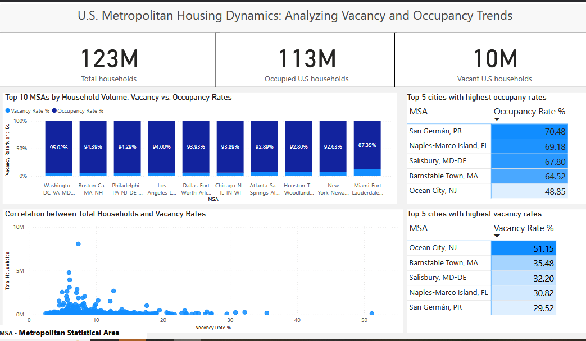

# Power BI Dashboard Collection

This repository contains a collection of dashboards created in Power BI, focusing on various topics. The dashboards are exported as PDF files for easy access and review.

## 📊 Dashboard Overviews

### 1. U.S. Metropolitan Housing Dynamics
- **Objective:** Analyze vacancy and occupancy trends across the United States.
- **Key Insights:**
  - Top cities with highest and lowest vacancy rates.
  - Correlation between household volume and vacancy rates.
- **PDF Version:** [View PDF](PDFs/U.S_Metropolitan_Housing_Dynamics.pdf)
- **PBIX File:** [Download PBIX](pbix-files/U.S_Metropolitan_Housing_Dynamics.pbix)

---

### 2. FDA Product Recalls Overview
- **Objective:** Examine the nature, severity, and distribution patterns of FDA product recalls.
- **Key Insights:**
  - Top firms involved in recalls.
  - Common reasons for product recalls.
  - Geographic distribution of recalls.
- **PDF Version:** [View PDF](PDFs/FDA_Product_Recalls_Overview.pdf)
- **PBIX File:** [Download PBIX](pbix-files/FDA_Product_Recalls_Overview.pbix)

---

### 3. Data Science Job Market Analysis
- **Objective:** Explore employment trends, salary distributions, and economic factors influencing the data science job market (2020–2023).
- **Key Insights:**
  - Highest-paying job categories and locations.
  - Employment trends by work setting and experience level.
  - Correlation between GDP growth and job growth.
- **PDF Version:** [View PDF](PDFs/Data_Science_Job_Market_Analysis.pdf)
- **PBIX File:** [Download PBIX](pbix-files/Data_Science_Job_Market_Analysis.pbix)

---

## 🖼️ Preview

Below are a few snapshots of the dashboards:

### U.S. Metropolitan Housing Dynamics

### FDA Product Recalls Overview

### Data Science Job Market Analysis

---

## 🚀 How to Use
1. Clone or download this repository.
2. Open the PDFs using any PDF viewer to explore the dashboards.
3. Preview images are provided for quick reference.
4. For interactive exploration, download the `.pbix` files and open them in Power BI Desktop.

## 📜 License
This project is shared under the [MIT License](LICENSE).

### Terms of Use
These dashboards are shared for educational and non-commercial purposes. Please provide proper attribution if you reference or reuse this work.
